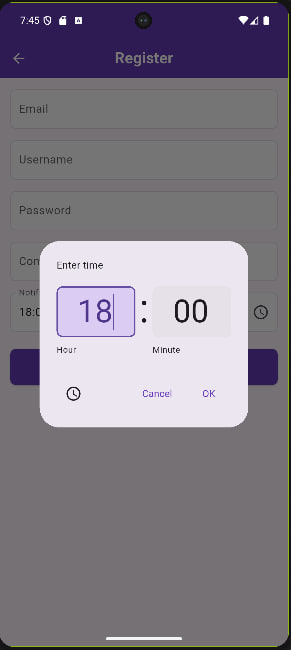
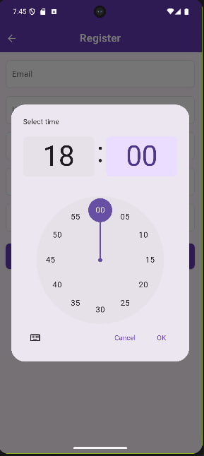
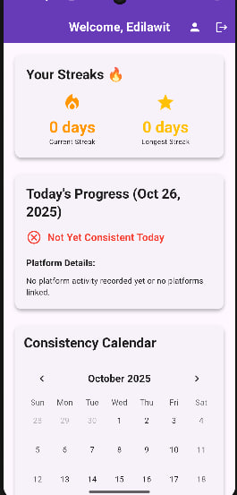
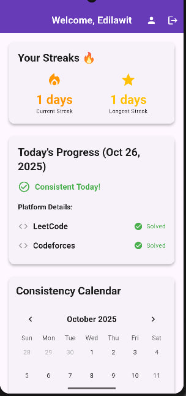
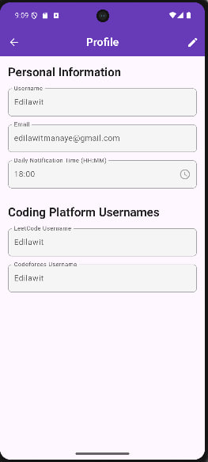

## Screenshots

<!-- Row 1: Welcome -->
<table>
  <tr>
    <th>Welcome</th>
  </tr>
  <tr>
    <td align="center">
      
    </td>
  </tr>
</table>

<!-- Row 2: Three Register screens (you can repeat Register or show variants: empty, filled, time picker) -->
<table>
  <tr>
    <th colspan="3">Sign Up</th>
  </tr>
  <tr>
    <td align="center">
      
    </td>
    <!-- <td align="center">
      
    </td> -->
    <td align="center">
      
    </td>
  </tr>
</table>

<!-- Row 3: Single Login -->
<table>
  <tr>
    <th>Login</th>
  </tr>
  <tr>
    <td align="center">
      
    </td>
  </tr>
</table>

<!-- Row 4: Two Dashboards with captions -->
<table>
  <tr>
    <th>Dashboard — Before solving</th>
    <th>Dashboard — After solving</th>
  </tr>
  <tr>
    <td align="center">
      
      
<i>Not Yet Consistent Today</i>

    </td>
    <td align="center">
      
      
<i>Consistent Today!</i>

    </td>
  </tr>
</table>

<!-- Row 5: Two Profile screens -->
<table>
  <tr>
    <th colspan="2">Profile</th>
  </tr>
  <tr>
    <td align="center">
      
    </td>
    <td align="center">
      
    </td>
  </tr>
</table>

