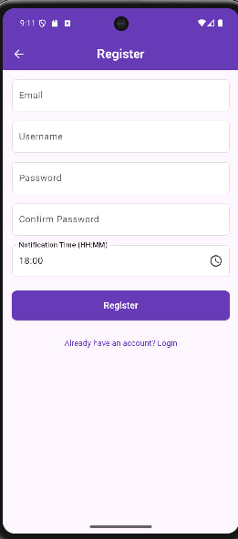

# Consistify

Consistify is a smart, cross‑platform Flutter app that helps developers keep their LeetCode/Codeforces practice consistent. It monitors daily activity and, at a user‑chosen cutoff time, sends a precise reminder so you don’t unintentionally skip a day and lose momentum.

## About Consistify
Consistify helps you build and protect your daily problem‑solving habit. Set your own reminder time, get a timely nudge, and keep your streak alive.

## The Problem
- Missed days happen unintentionally. Developers get busy and forget to solve a problem, breaking streaks they worked hard to build.
- Streak loss kills motivation. One lapse reduces streaks and breaks the habit loop that drives improvement.
- Skill erosion over time. Irregular practice slows progress and weakens problem‑solving fluency.
- No timely nudge. People don’t get reminders at the right time for them. Without a reminder set to their own schedule, they can easily miss the time to solve a problem.

## The Solution
Consistify tracks whether you solved a problem today and pairs it with a user‑defined notification time (set during registration or in Profile). If you haven’t solved anything by that time, the app sends a clear, actionable reminder to protect your streak and keep your skills sharp.

### How it works
- Monitors whether you solved at least one problem each day.
- Lets you pick your personal reminder time (e.g., 18:00).
- If no activity is detected by the cutoff, it triggers a reminder.

Example reminder text:
- “It’s 18:00 — solve one problem now to keep your streak alive.”
- “Don’t lose today! One quick solve preserves your consistency.”

## Features
- Authentication & Profile  
  Email + password (JWT). Update username, set daily notification time, manage platform usernames.
- Personalized Reminder  
  Sends a notification at your chosen time if no problem is solved yet.
- Daily Consistency Status  
  “Consistent Today” indicator with per‑platform status (no brand images).
- Streaks Overview  
  Current streak and longest streak at a glance.
- Consistency Calendar  
  Monthly calendar with green highlights for consistent days.
- Push & Local Notifications  
  Firebase Cloud Messaging + local notifications for timely nudges.
- Secure Local Storage  
  Tokens and minimal state cached via secure and shared storage.

## Screenshots

<!-- Row 1: Welcome -->
<table>
  <tr>
    <th>Welcome</th>
  </tr>
  <tr>
    <td align="center">
      
    </td>
  </tr>
</table>

<!-- Row 2: Three Register screens -->
<table>
  <tr>
    <th colspan="3">Sign Up</th>
  </tr>
  <tr>
    <td align="center">
      
    </td>
    <td align="center">
      
    </td>
    <td align="center">
      
    </td>
  </tr>
</table>

<!-- Row 3: Login -->
<table>
  <tr>
    <th>Login</th>
  </tr>
  <tr>
    <td align="center">
      
    </td>
  </tr>
</table>

<!-- Row 4: Two Dashboards with captions -->
<table>
  <tr>
    <th>Dashboard — Before solving</th>
    <th>Dashboard — After solving</th>
  </tr>
  <tr>
    <td align="center">
      
      
<i>Not Yet Consistent Today</i>

    </td>
    <td align="center">
      
      
<i>Consistent Today!</i>

    </td>
  </tr>
</table>

<!-- Row 5: Profile -->
<table>
  <tr>
    <th colspan="2">Profile</th>
  </tr>
  <tr>
    <td align="center">
      
    </td>
    <td align="center">
      
    </td>
  </tr>
</table>

## Tech Stack
- Flutter · Dart  
- flutter_bloc · bloc  
- http · JWT auth  
- Firebase Cloud Messaging · flutter_local_notifications  
- shared_preferences · flutter_secure_storage  
- get_it (DI) · dartz (Either)  
- table_calendar

## Status
- Actively developed. Play Store deployment pending. README showcases the app with screenshots; platform brand images are not used; per‑platform status shows “Solved / Not Solved”.
