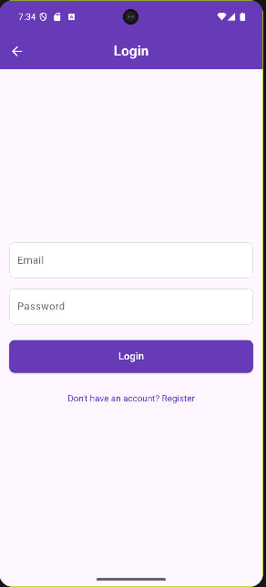

##  Consistify -The ultimate companion for maintaining coding consistency on LeetCode and Codeforces
🔔 Reminders · 📅 Daily check · 🔥 Streaks · 🛡️ JWT + local storage

Consistify is a smart, cross‑platform Flutter app that keeps your LeetCode/Codeforces practice on track. It checks whether you’ve solved a problem today and, at your personal cutoff time (e.g., 18:00), sends a precise reminder so you don’t skip a day or break your streak.
## 🚀 Problem
- Missed days happen unintentionally. Developers get busy and forget to solve a problem, breaking streaks they worked hard to build.
- Streak loss kills motivation. One lapse reduces streaks and breaks the habit loop that drives improvement.
- Skill erosion over time. Irregular practice slows progress and weakens problem‑solving fluency.
- No timely nudge. People don’t get reminders at the right time for them. Without a reminder set to their own schedule, they can easily miss the time to solve a problem.

## 💡 Solution
Consistify tracks whether you solved a problem today and pairs it with a user‑defined notification time (set during registration or in Profile). If you haven’t solved anything by that time, the app sends a clear, actionable reminder to protect your streak and keep your skills sharp.

### How it works
- Monitors whether you solved at least one problem each day.
- Lets you pick your personal reminder time (e.g., 18:00).
- If no activity is detected by the cutoff, it triggers a reminder.

Example reminder text:
- “It’s 18:00 — solve one problem now to keep your streak alive.”
- “Don’t lose today! One quick solve preserves your consistency.”

## ✨ Key Features

- 🔐 **Authentication & Profile**  
  Email + password (JWT). Update username, set daily notification time, manage platform usernames.

- 🔔 **Personalized Reminder**  
  Sends a notification at your chosen time if you haven’t solved a problem yet.

- 📅 **Daily Consistency Status**  
  Clear “Consistent Today” indicator with per‑platform status (no brand images).

- 🔥 **Streaks Overview**  
  See current and longest streaks to keep momentum high.

- 📬 **Push & Local Notifications**  
  Firebase Cloud Messaging + local notifications for reliable, on‑time nudges.

- 🛡️ **Secure Local Storage**  
  Tokens and minimal state stored safely (`shared_preferences`, `flutter_secure_storage`).

## 📸 Screenshots

<!-- Row 1: Welcome -->
<table>
  <tr>
    <th>Welcome</th>
  </tr>
  <tr>
    <td align="center">
      
    </td>
  </tr>
</table>

<!-- Row 2: Three Register screens -->
<table>
  <tr>
    <th colspan="3">Sign Up</th>
  </tr>
  <tr>
    <td align="center">
      
    </td>
    <td align="center">
      
    </td>
    <td align="center">
      
    </td>
  </tr>
</table>

<!-- Row 3: Login -->
<table>
  <tr>
    <th>Login</th>
  </tr>
  <tr>
    <td align="center">
      
    </td>
  </tr>
</table>

<!-- Row 4: Two Dashboards with captions -->
<table>
  <tr>
    <th>Dashboard — Before solving</th>
    <th>Dashboard — After solving</th>
  </tr>
  <tr>
    <td align="center">
      
      
<i>Not Yet Consistent Today</i>

    </td>
    <td align="center">
      
      
<i>Consistent Today!</i>

    </td>
  </tr>
</table>

<!-- Row 5: Profile -->
<table>
  <tr>
    <th colspan="2">Profile</th>
  </tr>
  <tr>
    <td align="center">
      
    </td>
    <td align="center">
      
    </td>
  </tr>
</table>

## 🧰 Tech Stack

  
  

  
  

  
  

  
  

  
  

  
  

  

